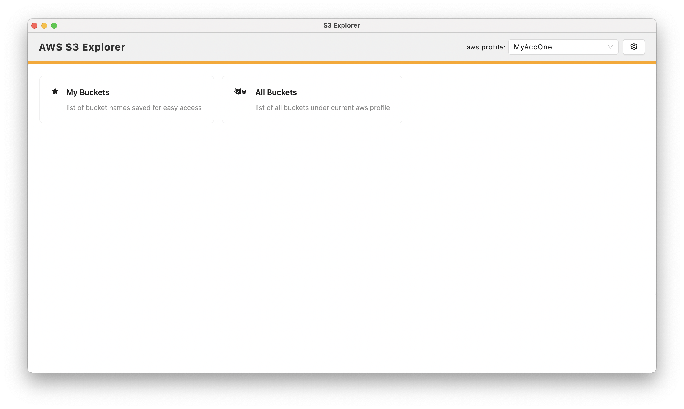

# **AWS S3 Explorer**

Cross platforms (win, mac,linux) AWS S3 Explorer

## Technology Stack

- electron-react-boilerplate (https://github.com/electron-react-boilerplate/electron-react-boilerplate)
- AWS SDK for JavaScript (https://aws.amazon.com/sdk-for-javascript/)
- antd v5 (https://ant.design/)


## Features:
- Read aws profiles from aws-cli if it is already installed in the machine
- Add AWS Profile with Access Key and Secret Access Key
- Download
  - support multiple files download
-  Upload files / folder
   - support multiple-part upload

## Screenshots



## Install

Clone the repo and install dependencies:

```bash
npm install
```

## Starting Development

Start the app in the `dev` environment:

```bash
npm start
```

## Packaging for Production

To package apps for the local platform:

```bash
npm run package
```
Package inaries will be output to `release/build` directory.


